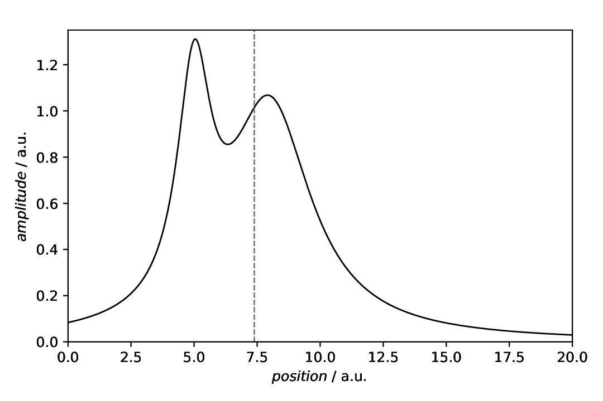
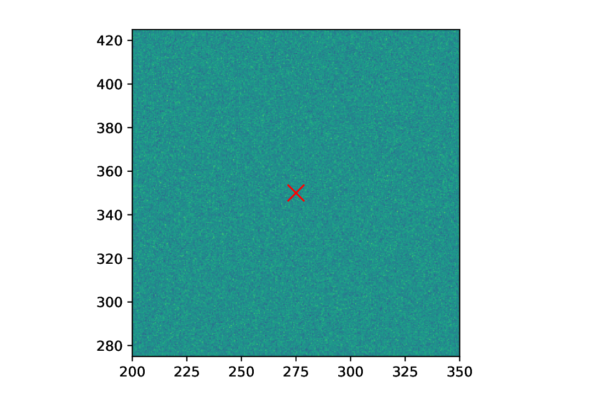

========================
Analysis: Centre of mass
========================

.. sidebar:: Contents

    .. contents::
        :local:
        :depth: 2

Classes used:

* Models:

  * :class:`aspecd.model.Zeros`
  * :class:`aspecd.model.Ones`
  * :class:`aspecd.model.CompositeModel`

* Analysis:

  * :class:`aspecd.analysis.CentreOfMass`

* Processing:

  * :class:`aspecd.processing.Noise`

* Plotting:

  * :class:`aspecd.plotting.SinglePlotter1D`
  * :class:`aspecd.plotting.SinglePlotter2D`

* Annotations:

  * :class:`aspecd.annotation.VerticalLine`
  * :class:`aspecd.annotation.Marker`

In Physics, the centre of mass of a body is the mass-weighted average of the positions of its mass points. It can be equally applied to an ND dataset, where the mass is related to the intensity value at a given point.

In one dimension, the centre of mass, :math:`x_s`, can be calculated by:

.. math::

    x_s = \frac{1}{M} \cdot \sum_{i=1}^{n} x_{i} \cdot m_{i}

with the total mass :math:`M`, *i.e.* the sum of all point masses:

.. math::

    M = \sum_{i=1}^{n} m_{i}

This can be generalised to arbitrary dimensions, defining the centre of mass as the mass-weighted average of the position vectors :math:`\vec{r}_i`:

.. math::

    \vec{r}_s = \frac{1}{M} \sum_{i}m_{i} \cdot \vec{r}_i

Recipe
======

Shown below is the entire recipe. As this is quite lengthy, separate parts will be detailed below in the "Results" section.

.. literalinclude:: analysis-centre-of-mass.yaml
    :language: yaml
    :linenos:
    :caption: Concrete example of a recipe demonstrating how to calculate and graphically display the centre of mass for 1D and 2D datasets.

Comments
========

* As usual, model datasets are created, to have something to work with. Here, a CompositeModel comprising of two Lorentizans is used to get an asymmetric curve with an interesting centre of mass. For the 2D case, purely Gaussian noise is created.
* For simplicity, generic plotters are used, to focus on the analysis.

Results
=======

Examples for the figures created in the recipe are given below. While in the recipe, the output format has been set to PDF, for rendering them here they have been converted to PNG.

As this is a longer recipe demonstrating different scenarios, the individual cases are shown separately, each with the corresponding section of the recipe.

Centre of mass for 1D datasets
------------------------------

The scenario: We have a curve -- in terms of statistics an asymmetric distribution -- and want to calculate and display the centre of mass. In spectroscopy, think of an anisotropic line where you would like to get the position of the isotropic peak.

Getting the centre of mass for this asymmetric line is straight-forward and rather unspectacular:

.. literalinclude:: analysis-centre-of-mass.yaml
    :language: yaml
    :linenos:
    :lines: 31-34
    :lineno-start: 31

Key here is to save the result to a variable, to be able to use the *x* coordinate for a plot annotation later on. This is what directly follows in the example recipe: plot the actual data and add a vertical line as plot annotation, using the result from the analysis as position:

.. literalinclude:: analysis-centre-of-mass.yaml
    :language: yaml
    :linenos:
    :lines: 36-64
    :lineno-start: 36

The resulting figure is shown below:

    Plot of an asymmetric curve with the centre of mass determined using the :class:`aspecd.analysis.CentreOfMass` analysis step highlighted using a vertical line as plot annotation.

Determining the centre of mass works for arbitrary data in arbitrary dimensions, and even with non-equal spacing of the axes.

Centre of mass for 2D datasets
------------------------------

While determining the centre of mass works for arbitrary dimensions, we restrict ourselves here to two dimensions and use the simplest of all models: a 2D array with purely Gaussian noise. In such case, one would expect the centre of mass to be pretty much at the centre of the 2D array, and this is indeed the case, as will be demonstrated in the figure below.

Getting the centre of mass for a 2D dataset is straight-forward and identical to the 1D case:

.. literalinclude:: analysis-centre-of-mass.yaml
    :language: yaml
    :linenos:
    :lines: 84-87
    :lineno-start: 84

Key here is again to save the result to a variable, to be able to use the coordinates for a plot annotation later on. Note that in case of 2D data, you will get two coordinates, and generally for *n*\ D data, of course *n* coordinates.

Marking a point in a 2D plot can be done by simply placing a marker at the respective position. For simplicity, we have used a :class:`aspecd.annotation.Marker` task and placed an "x" at the centre of mass:

.. literalinclude:: analysis-centre-of-mass.yaml
    :language: yaml
    :linenos:
    :lines: 89-115
    :lineno-start: 89

As we got the coordinates from the analysis step, we can directly use the result in the ``positions`` key here. The resulting figure is shown below:

    Plot of a 2D dataset consisting of purely Gaussian noise. As expected, the centre of mass is pretty much at the centre of the dataset.

As the dataset has quadratic shape, we have set the aspect ratio of the plot to ``equal`` in this case, in order to not distort the individual data points.