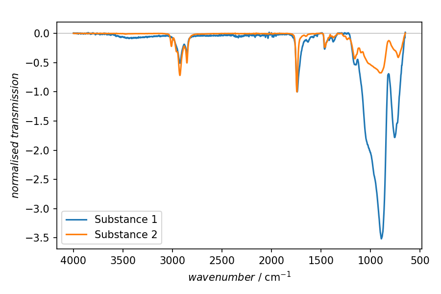

===========================================
FTIR spectra normalised to spectral feature
===========================================

Processing and displaying Fourier-transform infrared (FTIR) spectra, though generally pretty straight-forward, provides some rather hidden obstacles from the perspective of a general data analysis framework. This is due to two aspects of FTIR spectra not common to other spectroscopy data: Spectra are often displayed as transmission, *i.e.* with "negative" features, and the conventional *x* axis (in wavenumbers) is inverted.

In this particular example, FTIR spectra for two different samples have been recorded, and we are interested in comparing the spectra normalised to a particular spectral feature in the range of 1680 to 1750 wavenumbers.

To this end, a series of tasks needs to be performed on each dataset:

#. Import the data (assuming ASCII export)

#. Correct for DC offset, *i.e.* perform a baseline correction of 0-th order.

#. Normalise to the spectral feature used as a reference, but explicitly *not* to the entire recorded range.

#. Plot both spectra in one axis for graphical display of recorded data, following the convention in FTIR to plot an inverse *x* axis.

There are two ways to invert an axis: The preferred method is to explicitly set the axis property (note that you can specify which axis to invert or even both, if you provide a list). Alternatively, shown here as a comment, is to provide axis limits in descending order. While the latter method does do the trick, you need to explicitly provide axis limits in this case. This might, however, not be convenient.

In case of the data used here, the *x* axis is recorded in descending order. Therefore, for the baseline correction step, the five percent fitting range are taken from the left part in the figure, *i.e.* at high wavenumbers. Depending on how your data were recorded and how you set your plot initially, this may be confusing and lead to unexpected results.

.. note::

    As mentioned previously, using plain ASpecD usually does not help you with a rich data model of your dataset, containing all the relevant metadata. However, in the case shown here, it nicely shows the power of ASpecD on itself. Currently, there is no ASpecD-based Python package available for FTIR spectra, at least none the author of the ASpecD framework is aware of.

.. literalinclude:: ftir-normalised.yaml
    :language: yaml
    :linenos:
    :caption: Concrete example of a recipe used to plot a comparison of two FTIR spectra normalised to a spectral feature in the region of 1680 to 1750 wavenumbers as a reference. Key here is to specify the region to normalise in *axis units*, making it rather convenient for the user. Furthermore, as mentioned, FTIR spectra are plotted with an inverse *x* axis by convention. Besides that, the standard text file importer is used (with a few extra parameters such as to omit the header lines). Hence, *no metadata* are imported and the axis labels need to be set manually.

Result
======

    Result of the plotting step in the recipe shown above. The two spectra presented have been normalised to the transmission band between 1680 and 1750 wavenumbers.
