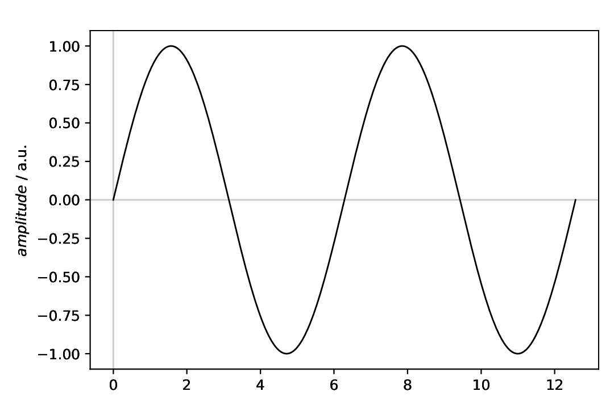
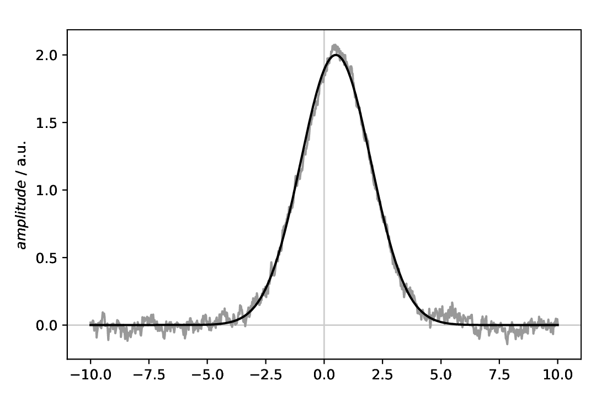

=======================
Models: An introduction
=======================

.. sidebar:: Contents

    .. contents::
        :local:
        :depth: 2

Classes used:

* Models:

  * :class:`aspecd.model.Zeros`
  * :class:`aspecd.model.Sine`
  * :class:`aspecd.model.Gaussian`

* Plotting:

  * :class:`aspecd.plotting.SinglePlotter1D`
  * :class:`aspecd.plotting.MultiPlotter1D`

* Processing:

  * :class:`aspecd.processing.Noise`

Although the primary motivation for the :mod:`aspecd.model` module is to provide mathematical models that can be used for fitting experimental data, in conjunction with the `FitPy package <https://docs.fitpy.de/>`_, they can be used to create artificial datasets and demonstrate the capabilities of the ASpecD framework.

As there are a few subtle differences between working with actual (imported) data and models, this page serves as an introduction wo working with model data.

Working with imported data vs. models
=====================================

The typical use case of the ASpecD framework, and even more so the packages based on it, is to work with actual data that are imported at the top of the recipe. Hence, a usual recipe will always contain a ``dataset`` block near the top with references to the data to import:

.. code-block:: yaml
    :linenos:

    format:
      type: ASpecD recipe
      version: '0.3'

    datasets:
      - /path/to/first/dataset
      - /path/to/second/dataset

    tasks:
      - kind: singleplot
        type: SinglePlotter1D

Furthermore, whatever task you perform, if you do not explicitly specify via an ``apply_to`` directive what datasets the task should be applied to, all of the datasets will be used.

When working with artificial data generated via models, two things are different:

* You do not need a ``dataset`` block, although you can of course mix imported real and artificial data.
* The model data, although resulting in datasets, will *not* be considered automatically in any task. Hence, you need to explicitly provide their respective label using the ``apply_to`` directive of each individual task.

A similar scenario to the one given above for the imported data would look like:

.. code-block:: yaml
    :linenos:

    format:
      type: ASpecD recipe
      version: '0.3'

    tasks:
      - kind: model
        type: Zeros
        properties:
          parameters:
            shape: 1001
            range: [-10, 10]
        result: dummy

      - kind: singleplot
        type: SinglePlotter1D
        apply_to: dummy

After this more general introduction, let's look at a series of example recipes. You can copy&paste and afterwards serve each of the recipes, or you can directly access it from the sources or download it from the `GitHub repository <https://github.com/tillbiskup/aspecd/tree/stable/docs/examples>`_.

A first recipe: Creating and plotting a sine
============================================

The task: Create a simple sine curve as dataset and plot it afterwards.

.. literalinclude:: model-introduction-sine.yaml
    :language: yaml
    :linenos:

Comments
--------

* The recipe shown here does *not* import any data, hence does not have the usual top-level block ``datasets``, but directly starts with the ``tasks`` block.
* We need to first define a "dummy" dataset with the correct dimensions. There are two types of models for this task available: :class:`aspecd.model.Zeros` (used here) and :class:`aspecd.model.Ones`.
* The actual model uses the ``from_dataset`` directive to obain the dimensions from the "dummy" dataset in the previous step.
* Plotting requires explicitly mentioning the model dataset using the ``apply_to`` directive.

Result
------

The resulting figure is shown below. While in the recipe, the output format has been set to PDF, for rendering images here they have been converted to PNG.

    Sine with standard parameters.

A noisy Gaussian
================

A model often encountered in spectroscopy is a Gaussian, or bell-shaped curve. There are different Gaussians available as model, namely :class:`aspecd.model.Gaussian` for the generalised variant, and :class:`aspecd.model.NormalisedGaussian` for the normalised variant frequently used when describing line shapes of spectral lines.

The task: Create a Gaussian as dataset, add some noise, and plot both, the original and the noisy one afterwards.

.. literalinclude:: model-introduction-gaussian.yaml
    :language: yaml
    :linenos:

Comments
--------

* The range for the "dummy" dataset has been adjusted to fit a Gaussian with its symmetric, bell-shaped curve.
* For the Gaussian, the three possible parameters ``amplitude``, ``position``, and ``width`` are set explicitly.
* For adding the noise, the same applies as for the plot: You need to explicitly provide the model dataset to operate on using the ``apply_to`` directive.
* When adding the noise, make sure to provide a ``result`` as well, as we want to plot both, the original and the noisy Gaussian afterwards.
* For the plot, the sequence you provide the dataset names in the ``apply_to`` directive does matter. Usually, in plots like the one shown here, you would like to have the "model" (noise-free data) shown *on top of* the experimental data, faked here by adding noise.
* In the plotter, colours for the individual lines have been set explicitly. Please note that in case of specifying colours in YAML recipes as hexadecimal values, you need to explicitly mark them as string by surrounding them with quotes.

Result
------

The resulting figure is shown below. While in the recipe, the output format has been set to PDF, for rendering images here they have been converted to PNG.

    Gaussian with (coloured, 1/*f*) noise added, and on top the original Gaussian. Note that due to the random component of the noise, your figure will look different regarding the noise.
