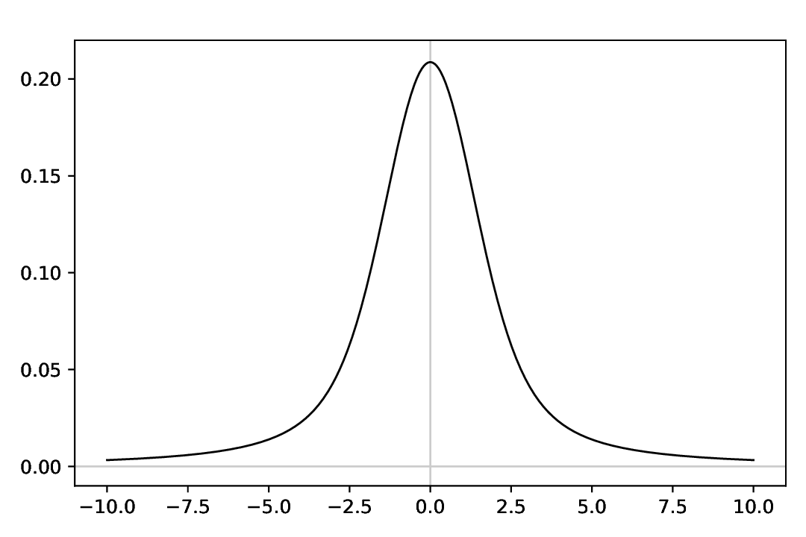
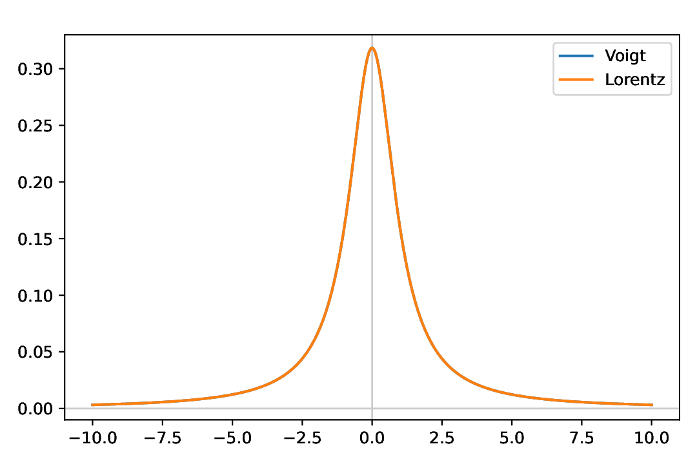
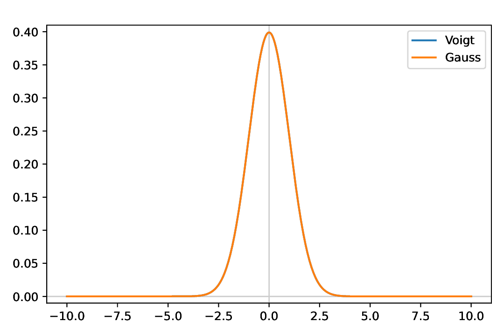
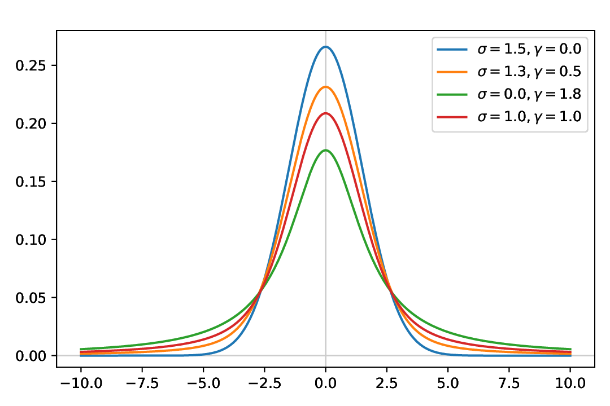

======================
Models: Voigt profiles
======================

Classes used:

* Models:

  * :class:`aspecd.model.Zeros`
  * :class:`aspecd.model.Voigtian`
  * :class:`aspecd.model.NormalisedGaussian`
  * :class:`aspecd.model.NormalisedLorentzian`

* Plotting:

  * :class:`aspecd.plotting.SinglePlotter1D`
  * :class:`aspecd.plotting.MultiPlotter1D`

The Voigt profile (after Woldemar Voigt) is a probability distribution given by a convolution of a Cauchy-Lorentz distribution (with half-width at half-maximum ``gamma``) and a Gaussian distribution (with standard deviation ``sigma``). It is often used for analyzing spectroscopic data.

In spectroscopy, a Voigt profile results from the convolution of two broadening mechanisms: life-time broadening (Lorentzian part) and inhomogeneous broadening (Gaussian part).

Recipe
======

.. literalinclude:: model-voigt-varying.yaml
    :language: yaml
    :linenos:
    :caption: Concrete example of a recipe used to create Voigt profiles from the respective model :class:`aspecd.model.Voigtian`. As the Voigt profile is a convolution of a Gaussian and Lorentzian line, setting the contribution of either component to zero should result in pure Lorentzian or Gaussian lines, respectively. This is demonstrated, and furthermore the variation of the parameters ``gamma`` and ``sigma`` for the line widths of the Lorentzian and Gaussian component, respectively. The latter reproduces the figure shown in the documentation of the underlying function :func:`scipy.special.voigt_profile`.

Comments
========

* The recipe shown here does *not* import any data, hence does not have the usual top-level block ``datasets``, but directly starts with the ``tasks`` block.
* To remove the *y* label, set it to ``Null`` in the recipe, the YAML analogon to :class:`None` in Python.

Results
=======

Examples for the figures created in the recipe are given below. While in the recipe, the output format has been set to PDF, for rendering them here they have been converted to PNG.

.. note::

    The command line magic used to convert the PDF images to PNG images was:

    .. code-block:: bash

        for k in model-voigt*pdf; do echo ${k%.*}; convert -density 180 $k ${k%.*}.png; done

A Voigt profile with standard parameters, *i.e.* ``gamma = 1`` and ``sigma = 1``, results in a line shape with additive line widths of Lorentzian and Gaussian contributions. Hence, the line is clearly wider than the individual components, as shown below.

    Voigt profile with standard parameters, *i.e.* ``gamma = 1`` and ``sigma = 1``.

As a Voigt profile is a convolution of Lorentzian and Gaussian contributions, setting the line width of either contribution to zero should result in a pure line shape, either Lorentzian or Gaussian. This is demonstrated below for both cases.

    Comparing a Voigt profile with purely Lorentzian contributions, *i.e.* ``gamma = 1`` and ``sigma = 0``, to a (normalised) Lorentzian. The lines completely overlap, as expected.

    Comparing a Voigt profile with purely Gaussian contributions, *i.e.* ``gamma = 0`` and ``sigma = 1``, to a (normalised) Gaussian. The lines completely overlap, as expected.

Last but not least, a figure from the documentation of the :func:`scipy.special.voigt_profile` used to compute the Voigt profile is recreated and shown below. For didactic purposes, the line widths of the Lorentzian (``gamma``) and Gaussian (``sigma``) components are varied.

    Voigt profile with varying parameters for the Lorentzian (``gamma``) and Gaussian (``sigma``) contributions.

