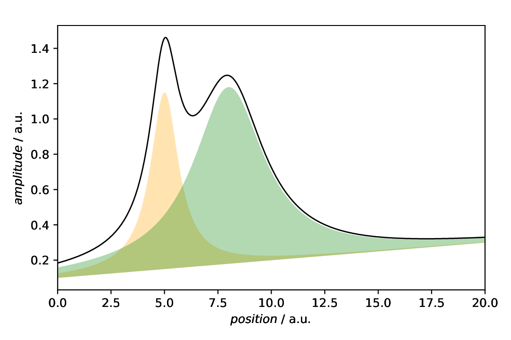

=============================
Plot annotations: FillBetween
=============================

.. sidebar:: Contents

    .. contents::
        :local:
        :depth: 2

Classes used:

* Models:

  * :class:`aspecd.model.Zeros`
  * :class:`aspecd.model.Lorentzian`
  * :class:`aspecd.model.Polynomial`
  * :class:`aspecd.model.CompositeModel`

* Processing:

  * :class:`aspecd.processing.DatasetAlgebra`

* Plotting:

  * :class:`aspecd.plotting.SinglePlotter1D`
  * :class:`aspecd.plotting.MultiPlotter1D`

* Annotations:

  * :class:`aspecd.annotation.FillBetween`

Graphical representation of data and results is one of the most important aspects of presenting scientific results. A good figure is a figure allowing the reader to immediately catch the important aspects, not relying on reading the (nevertheless always important) caption with more description.

To this end, there is the frequent need to annotate figures, *i.e.* add additional lines, areas, or even text. This is what can be done with the concrete subclasses of :class:`aspecd.annotation.PlotAnnotation`.

Here, we focus on **filling areas below or between curves** that can be used, *e.g.*, to highlight individual components. Suppose you have fitted a spectral line with a series of Lorentzians, and you would like to show the individual components as shaded areas. That's exactly what :class:`aspecd.annotation.FillBetween` is designed for.

Recipe
======

Shown below is the entire recipe. As this is quite lengthy, separate parts will be detailed below in the "Results" section.

.. literalinclude:: plotting-annotation-fillbetween.yaml
    :language: yaml
    :linenos:
    :caption: Concrete example of a recipe demonstrating some of the ways to add annotations to plot(ter)s, in this case shaded areas below and between curves.

Comments
========

* As usual, a model dataset is created at the beginning, to have something to show. Here, a CompositeModel comprising of two Lorentizans is used to get two peaks that can be labelled.
* Furthermore, the individual Lorentzians are created as well.
* For simplicity, generic plotters are used, to focus on the annotations.
* The sequence of defining plot and annotation(s) does not matter. You only need to provide the ``result`` key with a unique name for whichever task you define first, to refer to it in the later task(s).

Results
=======

Examples for the figures created in the recipe are given below. While in the recipe, the output format has been set to PDF, for rendering them here they have been converted to PNG.

As this is a rather lengthy recipe demonstrating different scenarios, the individual cases are shown separately, each with the corresponding section of the recipe.

Setting the scene
-----------------

The scenario: We have a curve comprising of two overlapping Lorentzians and want to highlight the individual components. Here, we just plot the data and the individual components.

.. literalinclude:: plotting-annotation-marker.yaml
    :language: yaml
    :linenos:
    :lines: 49-72
    :lineno-start: 49

The resulting figure is shown below:

    Plot showing the composite model consisting of two Lorentzians together with the individual components. This is a typical scenario where one would like to add a shading below the curves of the individual components.

FillBetween with default settings
---------------------------------

The scenario is as described above: We have a curve comprising of two overlapping Lorentzians and want to highlight the individual components. To fill the area below the curves of the individual components, we can use a :class:`aspecd.annotation.FillBetween` annotation.

.. literalinclude:: plotting-annotation-marker.yaml
    :language: yaml
    :linenos:
    :lines: 74-102
    :lineno-start: 74

The resulting figure is shown below:

    Plot with shading of the individual components as annotation. Note that the individual components are plotted explicitly as well, using a :class:`aspecd.plotting.MultiPlotter1D`.

The default settings are most probably not exactly what we usually want to have. First of all, individual components should often been marked with different colours, and adding a bit of transparency may help as well. Off we go.

Individual annotations with styling
-----------------------------------

In the example above, we have shown the default styling of the :class:`aspecd.annotation.FillBetween` annotation. As this is not quite what we usually would like to see, here, we apply some styling. For details of the parameters you can set, have a look at :class:`aspecd.plotting.PatchProperties`.

.. literalinclude:: plotting-annotation-marker.yaml
    :language: yaml
    :linenos:
    :lines: 104-149
    :lineno-start: 104

The resulting figure is shown below:

    Plot with both components styled individually. Here, we applied a colour (note the difference between ``facecolor`` and ``edgecolor`` for this type of annotation) and some transparency.

Individual annotations in a SinglePlotter
-----------------------------------------

Quite similar to the situation above, we need not use a :class:`aspecd.plotting.MultiPlotter` to show the individual components, as the annotation would be sufficient. Note that we stored the annotations for the individual lines declared above using the ``result`` key, so that we can reuse them here.

.. literalinclude:: plotting-annotation-marker.yaml
    :language: yaml
    :linenos:
    :lines: 151-168
    :lineno-start: 151

The resulting figure is shown below:

    Plot showing only the line of the composite model, annotated with the shaded areas of the indivual components.

Data with baseline
------------------

By default, and if not providing a second line, the patch extends from zero to the data points given by the actual data of the curve. While you could set a scalar value different from zero, more often you will encounter baselines, at least in spectroscopy and in real life. Here, we first (re)create the same data as above, but this time with a baseline added. To add the baseline to both, the model data and the individual components, we use the :class:`aspecd.processing.DatasetAlgebra` processing step. Afterwards, the data with baseline are plotted together with the baseline.

.. literalinclude:: plotting-annotation-marker.yaml
    :language: yaml
    :linenos:
    :lines: 170-222
    :lineno-start: 170

The resulting figure is shown below:

    Data with a baseline added, together with the baseline. A bit of styling is applied here, to show that the baseline is just an addition, not the actual data of interest.

Filling between two curves
--------------------------

Having data with a baseline, this is finally a sensible real-world situation where you may want to provide a second dataset as boundary for the patch. Of course, other typical scenarios are marking the confidence interval of a fit, where you have the lower and upper boundaries as dataset.

.. literalinclude:: plotting-annotation-marker.yaml
    :language: yaml
    :linenos:
    :lines: 224-272
    :lineno-start: 224

The resulting figure is shown below:

    Data with baseline together with the individual components, but respecting the baseline as (in this case lower) boundary of the fill patch.
