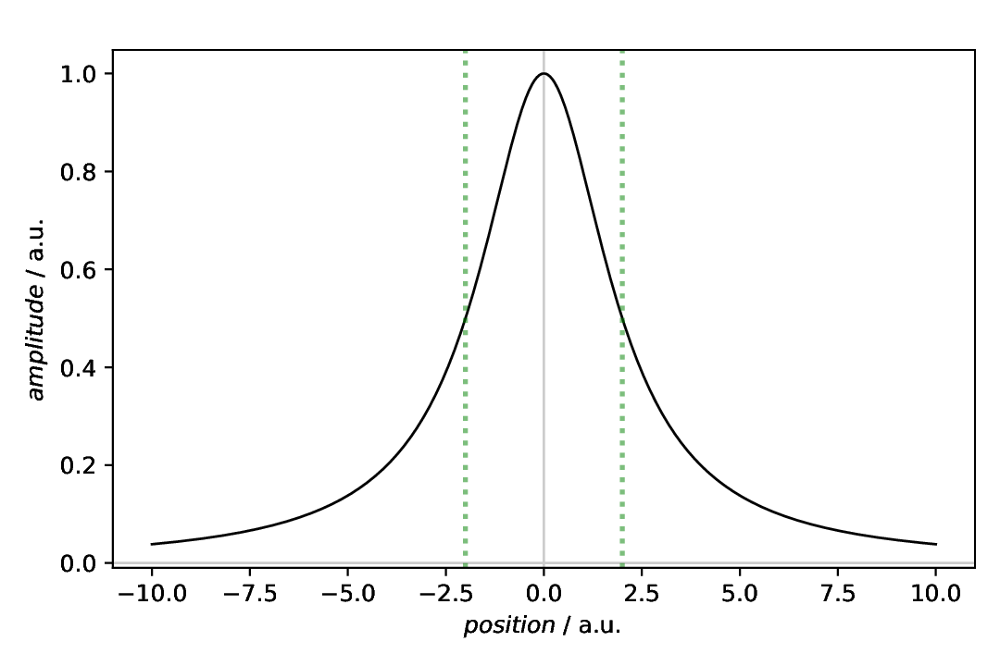
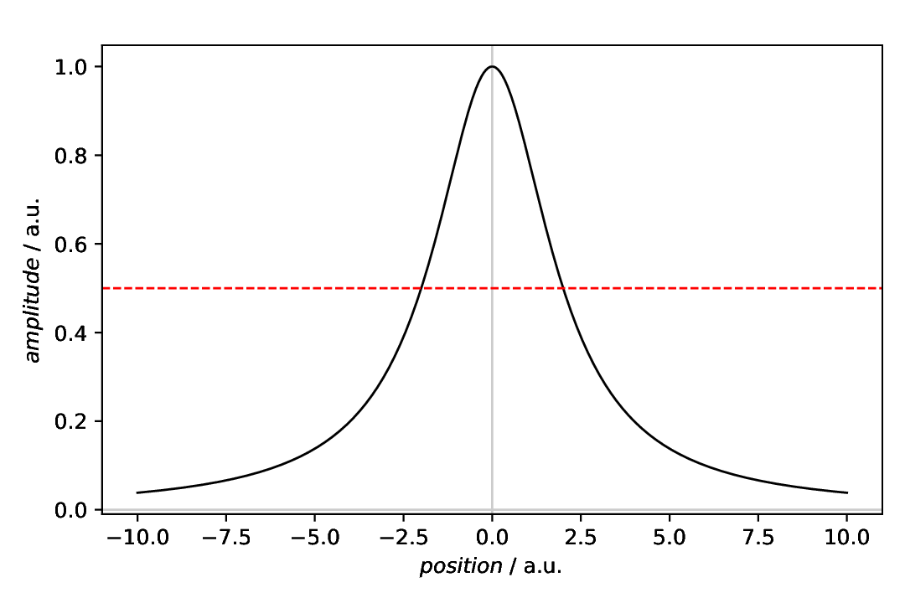
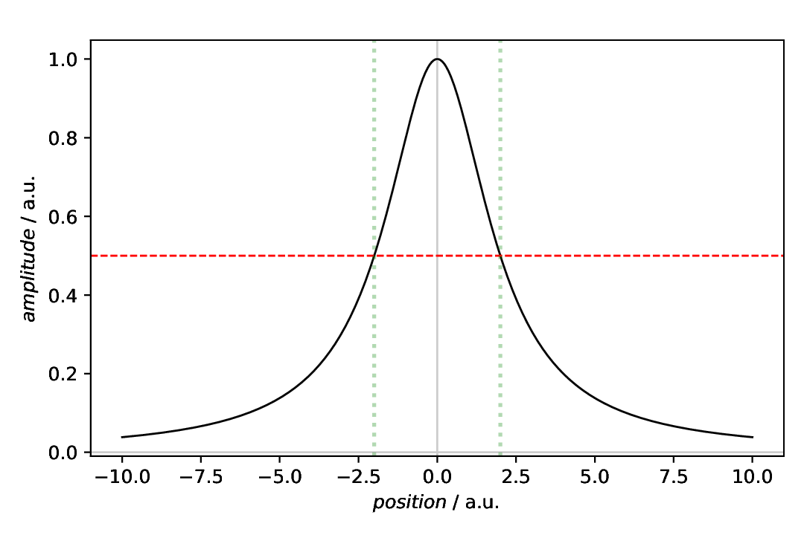

=======================
Plot annotations: Lines
=======================

.. sidebar:: Contents

    .. contents::
        :local:
        :depth: 2

Classes used:

* Models:

  * :class:`aspecd.model.Zeros`
  * :class:`aspecd.model.NormalisedGaussian`

* Plotting:

  * :class:`aspecd.plotting.SinglePlotter1D`
  * :class:`aspecd.annotation.VerticalLine`
  * :class:`aspecd.annotation.HorizontalLine`

Graphical representation of data and results is one of the most important aspects of presenting scientific results. A good figure is a figure allowing the reader to immediately catch the important aspects, not relying on reading the (nevertheless always important) caption with more description.

To this end, there is the frequent need to annotate figures, *i.e.* add additional lines, areas, or even text. This is what can be done with the concrete subclasses of :class:`aspecd.annotation.PlotAnnotation`.

Here, we focus on simple **vertical and horizontal lines** added to a plot that are often used as a guide to the eye of the reader.

Recipe
======

Shown below is the entire recipe. As this is quite lengthly, separate parts will be detailed below in the "Results" section.

.. literalinclude:: plotting-annotation-lines.yaml
    :language: yaml
    :linenos:
    :caption: Concrete example of a recipe demonstrating some of the many different modes of sharing axes. You can share *x* and *y* axes separately, and you can share *x* axes column-wise and *y* axes row-wise.

Comments
========

* As usual, a model dataset is created at the beginning, to have something to show. Here, a Lorentizan with a slightly increased line width. Using the Lorentzian is based on the very simple mathematical relation between line width and FWHM.
* For simplicity, a generic plotter is used, to focus on the annotations.
* The sequence of defining plot and annotation(s) does not matter. You only need to provide the ``result`` key with a unique name for whichever task you define first, to refer to it in the later task(s).
* Styling the lines, as shown here for pure demonstration purposes, shall be used carefully in scientific presentations, but can nevertheless be very helpful.
* While technically speaking, you could highlight entire regions by setting a rather large line width, colour, and possibly transparency, this is the realm of the dedicated :class:`aspecd.annotation.VerticalSpan` and :class:`aspecd.annotation.HorizontalSpan` annotations.

Results
=======

Examples for the figures created in the recipe are given below. While in the recipe, the output format has been set to PDF, for rendering them here they have been converted to PNG.

As this is a rather lengthy recipe demonstrating different scenarios, the individual cases are shown separately, each with the corresponding section of the recipe.

Vertical lines
--------------

The scenario: We have a Lorentzian and want to mark the full width at half maximum (FWHM). Thankfully, the respective positions for the vertical lines have a very simple mathematical relation to the line width set: the FWHM is exactly twice the line width.

Here, we first plot the data, and afterwards annotate the plot with an annotation. This is why the plot task as a result set with its ``result`` key that is referred to in the annotation task with the ``plotter`` key.

.. literalinclude:: plotting-annotation-lines.yaml
    :language: yaml
    :linenos:
    :lines: 27-56
    :lineno-start: 27

Note that you provide a list of positions for the lines. While it is always a list, this allows you to provide arbitrary numbers of positions for vertical lines.

The appearance of the lines can be controlled in quite some detail. For the styling available, see the documentation of the :class:`aspecd.plotting.LineProperties` class - and use sparingly in scientific context. After all, it is science, not pop art.

The resulting figure is shown below:

    Plot with two vertical lines as annotation. These two lines together mark the full width at half maximum (FWHM) of the displayed Lorentzian curve. While not always sensible in scientific context, the lines have been styled here, using a different line style, width, color, and transparency. Note that in this case, the plot(ter) has been defined first, with a ``result`` key for later reference, and the annotation afterwards, referring to the plotter using the ``plotter`` key.

Horizontal line
---------------

The scenario is similar to the one above: We have a Lorentzian and want to mark the half maximum corresponding to the full width at half maximum (FWHM). Given that we have a Lorentzian with maximum set to 1 (default value), this is trivial in our case.

Here, we first create the annotation and afterwards plot the data and annotate the plot with this annotation. This is why the annotation task as a result set with its ``result`` key that is referred to in the plotter task with the ``annotations`` key. Mind the plural here, as a plot can be annotated with more than one annotation.

.. literalinclude:: plotting-annotation-lines.yaml
    :language: yaml
    :linenos:
    :lines: 58-85
    :lineno-start: 58

Note that you need to provide a list of positions for the lines, even if you only want to have one line, as in this case.

Regarding styling of the lines, the same is true as said above: use carefully in a scientific context, and always have in mind that some people would like to print out your figure(s) greyscale, as colour is still expensive. See the documentation of the :class:`aspecd.plotting.LineProperties` class for styling options available.

The resulting figure is shown below:

    Plot with one horizontal line as annotation. This line marks the half maximum relevant for the full width at half maximum (FWHM) of the displayed Lorentzian curve. This line has been styled as well slightly.  Note that in this case, the annotation has been defined first, with a ``result`` key for later reference, and the plot(ter) afterwards, referring to the annotation using the ``annotations`` key. Mind the plural here, as a plotter can have multiple annotations.

Vertical and horizontal lines
-----------------------------

Of course, particularly for the scenario shown here where we want to mark the FWHM of a Lorentzian, combining both, vertical and horizontal lines may be sensible. This is shown in the final part of the recipe.

Although previously explicitly *not* mentioned, the first annotation had a ``results`` key as well that was unnecessary for the first part of the recipe. However, as you can see, you can define both, a plotter to annotate as well as a result label to use an annotation later.

As the two annotations used here have been defined previously, we show only the plotter here:

.. literalinclude:: plotting-annotation-lines.yaml
    :language: yaml
    :linenos:
    :lines: 87-102
    :lineno-start: 87

Finally, it is obvious, why the ``annotations`` key of the plot task is plural: you can (and often enough will) have more than one annotation in one plot.

The resulting figure is shown below:

    Plot with both previous annotations, one horizontal line and two vertical lines. These lines mark the full width at half maximum (FWHM) of the displayed Lorentzian curve. Note that here, the plotter makes use of both previously defined annotations. Upon closer inspection, you will see that the first annotation has a ``result`` key as well, although we didn't talk about it there and it was not necessary in the first scenario. As ths plotter has multiple annotations, the plural of the key ``annotations`` makes sense obviously.

