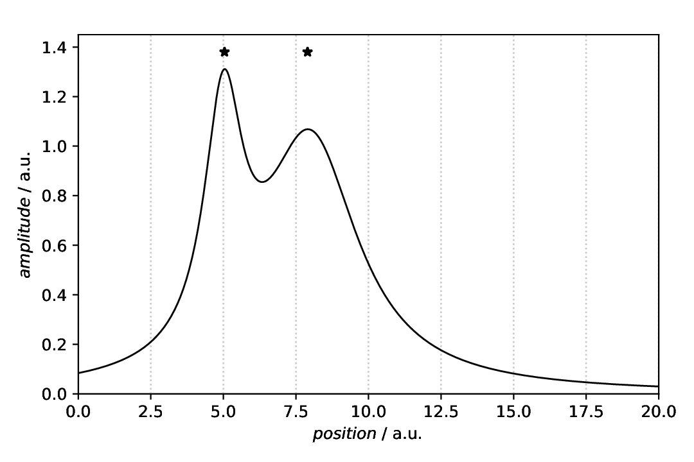
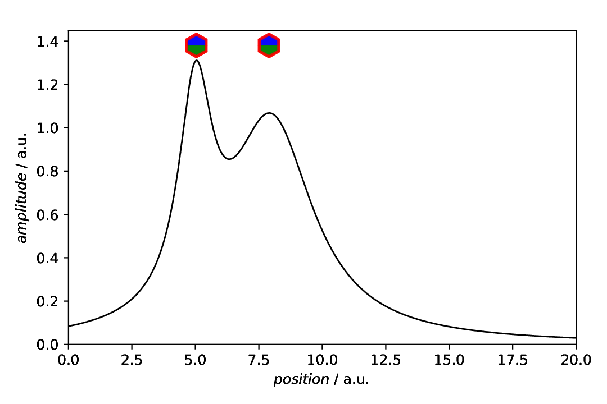
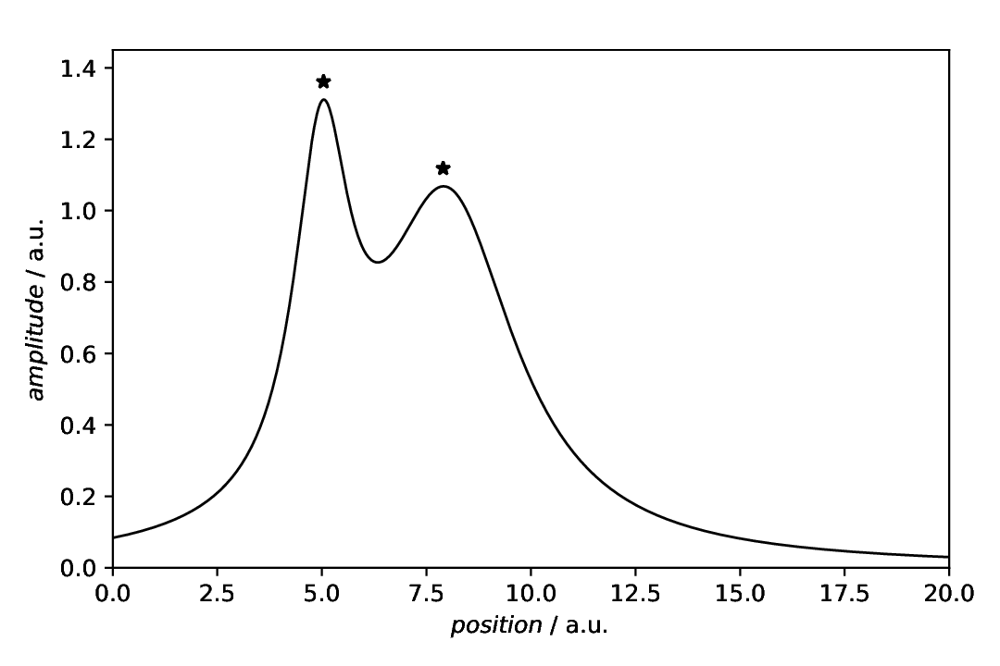
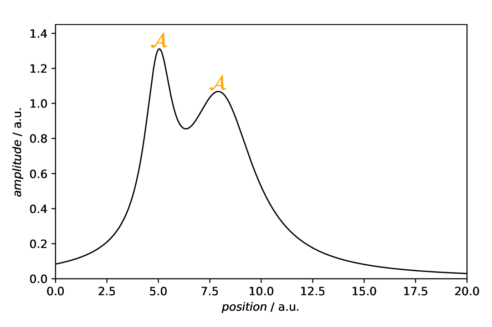
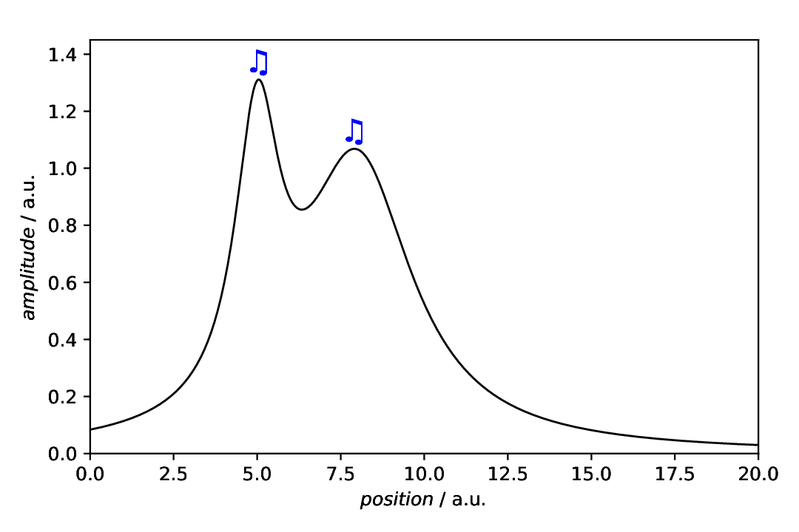

==================================
Plot annotations: Marker (symbols)
==================================

.. sidebar:: Contents

    .. contents::
        :local:
        :depth: 2

Classes used:

* Models:

  * :class:`aspecd.model.Zeros`
  * :class:`aspecd.model.CompositeModel`

* Analysis:

  * :class:`aspecd.analysis.PeakFinding`

* Plotting:

  * :class:`aspecd.plotting.SinglePlotter1D`

* Annotations:

  * :class:`aspecd.annotation.Marker`

Graphical representation of data and results is one of the most important aspects of presenting scientific results. A good figure is a figure allowing the reader to immediately catch the important aspects, not relying on reading the (nevertheless always important) caption with more description.

To this end, there is the frequent need to annotate figures, *i.e.* add additional lines, areas, or even text. This is what can be done with the concrete subclasses of :class:`aspecd.annotation.PlotAnnotation`.

Here, we focus on simple **markers (symbols)** added to a plot that are often used to label peaks.

Recipe
======

Shown below is the entire recipe. As this is quite lengthy, separate parts will be detailed below in the "Results" section.

.. literalinclude:: plotting-annotation-marker.yaml
    :language: yaml
    :linenos:
    :caption: Concrete example of a recipe demonstrating some of the ways to add annotations to plot(ter)s, in this case markers (symbols).

Comments
========

* As usual, a model dataset is created at the beginning, to have something to show. Here, a CompositeModel comprising of two Lorentizans is used to get two peaks that can be labelled.
* For simplicity, a generic plotter is used, to focus on the annotations.
* The sequence of defining plot and annotation(s) does not matter. You only need to provide the ``result`` key with a unique name for whichever task you define first, to refer to it in the later task(s).
* Styling the marker, as shown here once for pure demonstration purposes, shall be used carefully in scientific presentations, but can nevertheless be very helpful.

Results
=======

Examples for the figures created in the recipe are given below. While in the recipe, the output format has been set to PDF, for rendering them here they have been converted to PNG.

As this is a rather lengthy recipe demonstrating different scenarios, the individual cases are shown separately, each with the corresponding section of the recipe.

Simple marker
-------------

The scenario: We have a curve comprising of two overlapping Lorentzians and want to highlight the peaks. Using the :class:`aspecd.analysis.PeakFinding` analysis step allows us to place the labels at the correct *x* positions.

Here, we first plot the data, and afterwards annotate the plot with an annotation. This is why the plot task as a result set with its ``result`` key that is referred to in the annotation task with the ``plotter`` key.

.. literalinclude:: plotting-annotation-marker.yaml
    :language: yaml
    :linenos:
    :lines: 36-68
    :lineno-start: 36

As we got the *x* positions for our text labels from the analysis step (PeakFinding), we use the ``xpositions``and ``ypositions`` keys here, rather than the simple ``positions`` key. Furthermore, as we want to have both labels appear with the same *y* position, we can provide a scalar here for the key ``ypositions``. ``marker`` is a single identifier for the marker, and we used the shorthand for the star here.

The appearance of the markers can be controlled in quite some detail. For the styling available, see the documentation of the :class:`aspecd.plotting.MarkerProperties` class - and use sparingly in scientific context. After all, it is science, not pop art.

The resulting figure is shown below:

    Plot with two stars marking for the peak positions. Here, the default settings (colours and size) have been used. Note that in this case, the plot(ter) has been defined first, with a ``result`` key for later reference, and the annotation afterwards, referring to the plotter using the ``plotter`` key.

To demonstrate that the markers are indeed horizontally centred about the peaks, a grid (vertical dotted lines) has been added as guide for the eye of the reader in this case.

Styling the markers
-------------------

The scenario is the same as above: We have a curve comprising of two overlapping Lorentzians and want to highlight the peaks. Using the :class:`aspecd.analysis.PeakFinding` analysis step allows us to place the labels at the correct *x* positions.

Although not sensible in this particular case, this time the markers are styled extensively, just to show what is generally possible. For further details, refer to the documentation of the :class:`aspecd.plotting.MarkerProperties` class.

.. literalinclude:: plotting-annotation-marker.yaml
    :language: yaml
    :linenos:
    :lines: 70-105
    :lineno-start: 70

As we got the *x* positions for our text labels from the analysis step (PeakFinding), we use the ``xpositions``and ``ypositions`` keys here, rather than the simple ``positions`` key. In this case, we want to have the labels appear close to the actual line, hence with different *y* positions. Therefore, the ``ypositions`` key contains a list. As marker, we have used ``h`` here, a shorthand for a hexagon. Note that there is a variant ``H`` as well, with the hexagon standing on an edge rather than a tip, as in this case.

The appearance of the marker can be controlled in quite some detail. For the styling available, see the documentation of the :class:`aspecd.plotting.MarkerProperties` class - and use sparingly in scientific context. After all, it is science, not pop art.

The resulting figure is shown below:

    Plot with two markers for the peak positions as annotation. The markers are heavily styled, and a larger symbol used to show all the details.

Markers placed at the peaks
---------------------------

In the example above, we have shown how to automatically position the markers at the peak positions in the *x* direction, but still have positioned the annotations in the *y* direction manually. How about getting both, *x* and *y* position of the peaks automatically?

This is possible by using a new feature of the :class:`aspecd.analysis.PeakFinding` class, namely to explicitly return the intensities as well. Thus, you get a two-dimensional (two-column) numpy array with the peak positions (*x* values) in the first and the peak intensities (*y* values) in the second column. This can nicely be used to directly feed it into the ``positions`` key of the annotation;

.. literalinclude:: plotting-annotation-marker.yaml
    :language: yaml
    :linenos:
    :lines: 107-141
    :lineno-start: 107

The resulting figure is shown below:

    Plot with two markers for the peak positions as annotation. Instead of only providing the ``xpositions`` by the result of the :class:`PeakFinding <aspecd.analysis.PeakFinding>` analysis step, we got both, *x* and *y* positions, and thus used the ``positions`` key instead.

While it is clearly convenient to place the markers automatically in both, *x* and *y* direction, having the markers directly *on* the line is usually not satisfying. How about providing a (small) offset? We've got you covered...

Markers placed at the peaks with vertical offset
------------------------------------------------

In the example above, we have shown how to automatically position the markers at the peak positions in *x* and *y* direction, but the result was not entirely satisfying, as the marker usually sits *on* the line. How about having a small vertical offset?

.. literalinclude:: plotting-annotation-marker.yaml
    :language: yaml
    :linenos:
    :lines: 143-170
    :lineno-start: 143

The resulting figure is shown below:

    Plot with two markers for the peak positions as annotation. Instead of only providing the ``xpositions`` by the result of the :class:`PeakFinding <aspecd.analysis.PeakFinding>` analysis step, we got both, *x* and *y* positions, and thus used the ``positions`` key instead. Furthermore, using the ``yoffset`` key, we placed the markers slightly above the actual line.

Markers identified by name
--------------------------

There is a larger number of pre-defined markers available, and you can of course look up the symbols. However, there is an alternative: use readable names instead. For details, have a look at the documentation of the :attr:`aspecd.plotting.MarkerProperties.marker` attribute.

.. literalinclude:: plotting-annotation-marker.yaml
    :language: yaml
    :linenos:
    :lines: 172-201
    :lineno-start: 172

The resulting figure is shown below:

    Plot with markers identified by their name. Note that in this case, we added a very small vertical offset and set the ``edgewidth`` to zero, as depending on the type of marker, having finite edges looks a bit ugly.

Markers using MathText
----------------------

Although there is a larger number of pre-defined markers available, you can make use of the MathText feature of Matplotlib, even without LaTeX being installed, and put a huge variety of markers to your plots, using LaTeX syntax.

.. literalinclude:: plotting-annotation-marker.yaml
    :language: yaml
    :linenos:
    :lines: 203-237
    :lineno-start: 203

The resulting figure is shown below:

    Plot with markers using MathText (no LaTeX installation needed). Note that in this case, we set the ``edgewidth`` to zero, as otherwise, you get an effect similar to boldface. Furthermore, please note that in this particular case, you cannot have question marks surrounding the marker string, as otherwise, YAML is unhappy.

Markers using Unicode
---------------------

Using the MathText feature of Matplotlib, even without LaTeX being installed, allows to even use Unicode symbols (using STIX fonts) as markers. One example inspired by the Matplotlib documentation, is given below.

.. literalinclude:: plotting-annotation-marker.yaml
    :language: yaml
    :linenos:
    :lines: 239-273
    :lineno-start: 239

The resulting figure is shown below:

    Plot with markers using MathText (no LaTeX installation needed) to produce Unicode. Note that in this case, we set the ``edgewidth`` to zero, as otherwise, you get an effect similar to boldface. Furthermore, please note that in this particular case, you need to have question marks surrounding the marker string, as otherwise, YAML is unhappy.

This concludes our tour de force through using different kinds of markers.