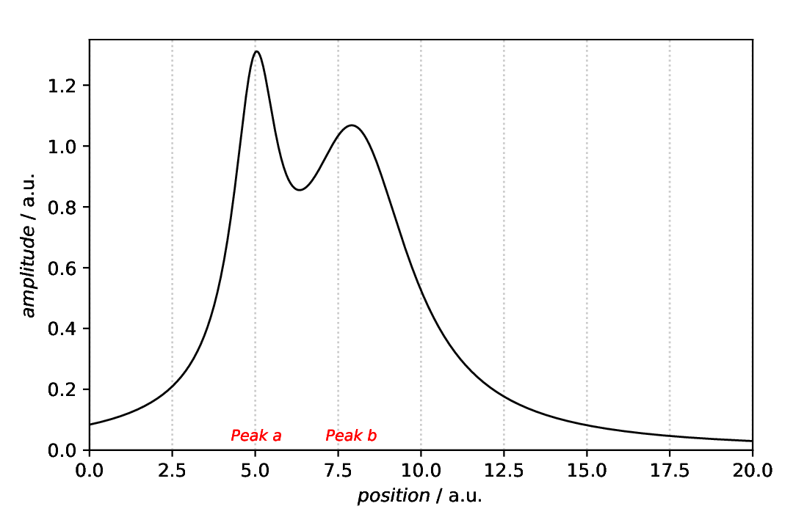
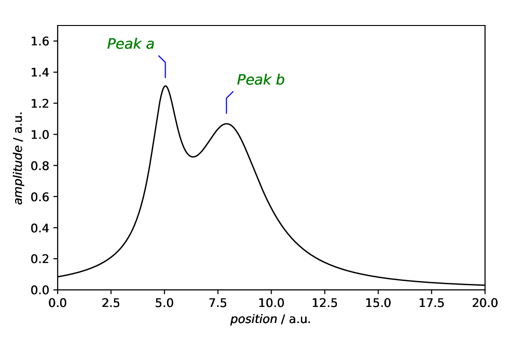

===================================
Plot annotations: Text (with lines)
===================================

.. sidebar:: Contents

    .. contents::
        :local:
        :depth: 2

Classes used:

* Models:

  * :class:`aspecd.model.Zeros`
  * :class:`aspecd.model.CompositeModel`

* Analysis:

  * :class:`aspecd.analysis.PeakFinding`

* Plotting:

  * :class:`aspecd.plotting.SinglePlotter1D`

* Annotations:

  * :class:`aspecd.annotation.Text`
  * :class:`aspecd.annotation.TextWithLine`

Graphical representation of data and results is one of the most important aspects of presenting scientific results. A good figure is a figure allowing the reader to immediately catch the important aspects, not relying on reading the (nevertheless always important) caption with more description.

To this end, there is the frequent need to annotate figures, *i.e.* add additional lines, areas, or even text. This is what can be done with the concrete subclasses of :class:`aspecd.annotation.PlotAnnotation`.

Here, we focus on simple **text** and **text with attached lines** added to a plot that are often used to label peaks. Note that these two kinds of annotations are quite different, although both involve text labels at given positions.

Recipe
======

Shown below is the entire recipe. As this is quite lengthy, separate parts will be detailed below in the "Results" section.

.. literalinclude:: plotting-annotation-text.yaml
    :language: yaml
    :linenos:
    :caption: Concrete example of a recipe demonstrating some of the ways to add annotations to plot(ter)s, in this case text and text with attached lines.

Comments
========

* As usual, a model dataset is created at the beginning, to have something to show. Here, a CompositeModel comprising of two Lorentizans is used to get two peaks that can be labelled.
* For simplicity, a generic plotter is used, to focus on the annotations.
* The sequence of defining plot and annotation(s) does not matter. You only need to provide the ``result`` key with a unique name for whichever task you define first, to refer to it in the later task(s).
* Styling the text (and lines), as shown here for pure demonstration purposes, shall be used carefully in scientific presentations, but can nevertheless be very helpful.

Results
=======

Examples for the figures created in the recipe are given below. While in the recipe, the output format has been set to PDF, for rendering them here they have been converted to PNG.

As this is a rather lengthy recipe demonstrating different scenarios, the individual cases are shown separately, each with the corresponding section of the recipe.

Text
----

The scenario: We have a curve comprising of two overlapping Lorentzians and want to highlight the peaks. Using the :class:`aspecd.analysis.PeakFinding` analysis step allows us to place the labels at the correct *x* positions.

Here, we first plot the data, and afterwards annotate the plot with an annotation. This is why the plot task as a result set with its ``result`` key that is referred to in the annotation task with the ``plotter`` key.

.. literalinclude:: plotting-annotation-text.yaml
    :language: yaml
    :linenos:
    :lines: 36-75
    :lineno-start: 36

As we got the *x* positions for our text labels from the analysis step (PeakFinding), we use the ``xpositions``and ``ypositions`` keys here, rather than the simple ``positions`` key. Furthermore, as we want to have both labels appear with the same *y* position, we can provide a scalar here for the key ``ypositions``. Of course, ``texts`` needs to be a list as well, with the same length as the positions.

The appearance of the text can be controlled in quite some detail. For the styling available, see the documentation of the :class:`aspecd.plotting.TextProperties` class - and use sparingly in scientific context. After all, it is science, not pop art. One particularly important setting here is the horizontal alignment using the  ``horizontalalignment`` key: Typically, you want to have your text labels in such case be centred horizontally.

The resulting figure is shown below:

    Plot with two text labels for the peak positions as annotation. While not always sensible in scientific context, the text has been styled here, using a different colour, font size and font style. Note that in this case, the plot(ter) has been defined first, with a ``result`` key for later reference, and the annotation afterwards, referring to the plotter using the ``plotter`` key.

To demonstrate that the labels are indeed horizontally centred about the peaks, a grid (vertical dotted lines) has been added as guide for the eye of the reader in this case.

Text with lines
---------------

The scenario is the same as above: We have a curve comprising of two overlapping Lorentzians and want to highlight the peaks. Using the :class:`aspecd.analysis.PeakFinding` analysis step allows us to place the labels at the correct *x* positions.

Here, we first create the annotation and afterwards plot the data and annotate the plot with this annotation. This is why the annotation task as a result set with its ``result`` key that is referred to in the plotter task with the ``annotations`` key. Mind the plural here, as a plot can be annotated with more than one annotation.

.. literalinclude:: plotting-annotation-text.yaml
    :language: yaml
    :linenos:
    :lines: 77-119
    :lineno-start: 76

As we got the *x* positions for our text labels from the analysis step (PeakFinding), we use the ``xpositions``and ``ypositions`` keys here, rather than the simple ``positions`` key. In this case, we want to have the labels appear close to the actual line, hence with different *y* positions. Therefore, the ``ypositions`` key contains a list. Of course, ``texts`` needs to be a list as well, with the same length as the positions.

The appearance of the text and connecting lines can be controlled in quite some detail. For the styling available, see the documentation of the :class:`aspecd.plotting.AnnotationProperties` class - and use sparingly in scientific context. After all, it is science, not pop art. Note that you *cannot* set the text alignment for this type of annotations, as it gets set automatically for you depending on the horizontal offset between the position and the text label.

The resulting figure is shown below:

    Plot with two text labels with attached lines for the peak positions as annotation. Note that in this case, the annotation has been defined first, with a ``result`` key for later reference, and the plot(ter) afterwards, referring to the annotation using the ``annotations`` key. Mind the plural here, as a plotter can have multiple annotations.

