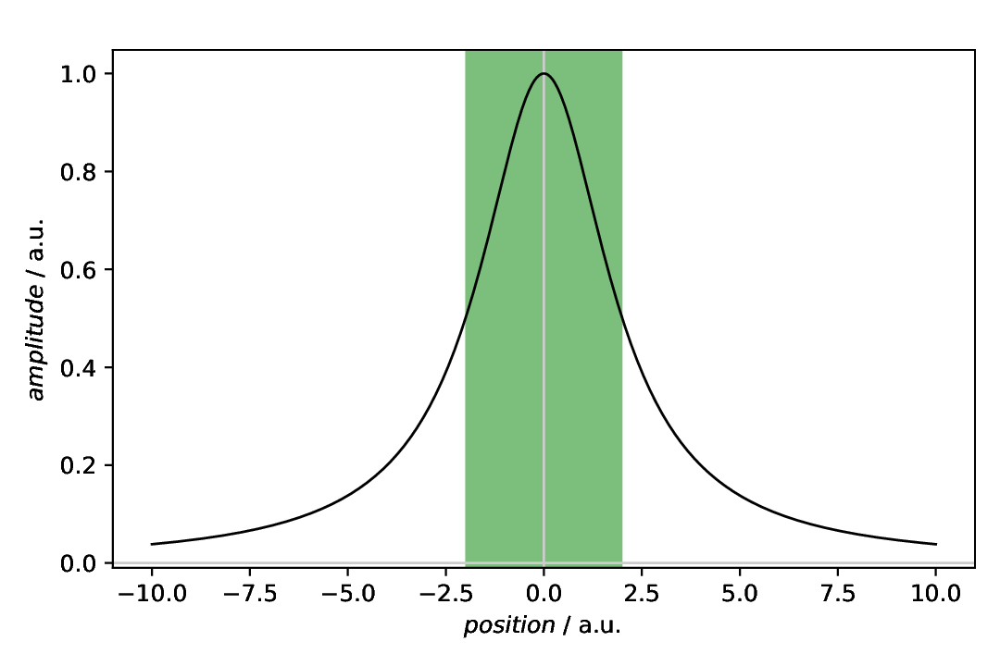

======================================
Plot annotations: Vertical span (area)
======================================

.. sidebar:: Contents

    .. contents::
        :local:
        :depth: 2

Classes used:

* Models:

  * :class:`aspecd.model.Zeros`
  * :class:`aspecd.model.Lorentzian`

* Plotting:

  * :class:`aspecd.plotting.SinglePlotter1D`
  * :class:`aspecd.annotation.VerticalSpan`

Graphical representation of data and results is one of the most important aspects of presenting scientific results. A good figure is a figure allowing the reader to immediately catch the important aspects, not relying on reading the (nevertheless always important) caption with more description.

To this end, there is the frequent need to annotate figures, *i.e.* add additional lines, areas, or even text. This is what can be done with the concrete subclasses of :class:`aspecd.annotation.PlotAnnotation`.

Here, we focus on simple **vertical spans** (areas) added to a plot that are often used to highlight particular regions, such as peaks.

Recipe
======

Shown below is the entire recipe. Although this time, it is rather short, the crucial part will be detailed below in the "Results" section.

.. literalinclude:: plotting-annotation-vertical-span.yaml
    :language: yaml
    :linenos:
    :caption: Concrete example of a recipe demonstrating how to mark an area by a vertical shaded patch, a "vertical span".

Comments
========

* As usual, a model dataset is created at the beginning, to have something to show. Here, a Lorentizan with a slightly increased line width. Using the Lorentzian is based on the very simple mathematical relation between line width and FWHM.
* For simplicity, a generic plotter is used, to focus on the annotation.
* The sequence of defining plot and annotation(s) does not matter. You only need to provide the ``result`` key with a unique name for whichever task you define first, to refer to it in the later task(s). For details, see the :doc:`plotting-annotation-lines` example.
* Styling the span, as shown here for demonstration purposes, shall be used carefully in scientific presentations, but can nevertheless be very helpful.

Results
=======

Examples for the figures created in the recipe are given below. While in the recipe, the output format has been set to PDF, for rendering them here they have been converted to PNG.

The scenario: We have a Lorentzian and want to mark the full width at half maximum (FWHM). Thankfully, the respective positions for the vertical lines have a very simple mathematical relation to the line width set: the FWHM is exactly twice the line width.

Here, we first plot the data, and afterwards annotate the plot with an annotation. This is why the plot task as a result set with its ``result`` key that is referred to in the annotation task with the ``plotter`` key.

.. literalinclude:: plotting-annotation-vertical-span.yaml
    :language: yaml
    :linenos:
    :lines: 27-56
    :lineno-start: 27

Note that you provide a list of positions for the span. As each span has a left and right position, this amounts to a list of lists. Being a list (of lists), this allows you to provide arbitrary numbers of positions for vertical spans.

The appearance of the patches (spans) can be controlled in quite some detail. For the styling available, see the documentation of the :class:`aspecd.plotting.PatchProperties` class - and use sparingly in scientific context. After all, it is science, not pop art.

The resulting figure is shown below:

    Plot with a vertical span as annotation, marking the full width at half maximum (FWHM) of the displayed Lorentzian curve. While not always sensible in scientific context, the span has been styled here using colour, transparency, and zorder. The latter puts the shared area in the background of the figure. Note that here, the plot(ter) has been defined first, with a ``result`` key for later reference, and the annotation afterwards, referring to the plotter using the ``plotter`` key.

