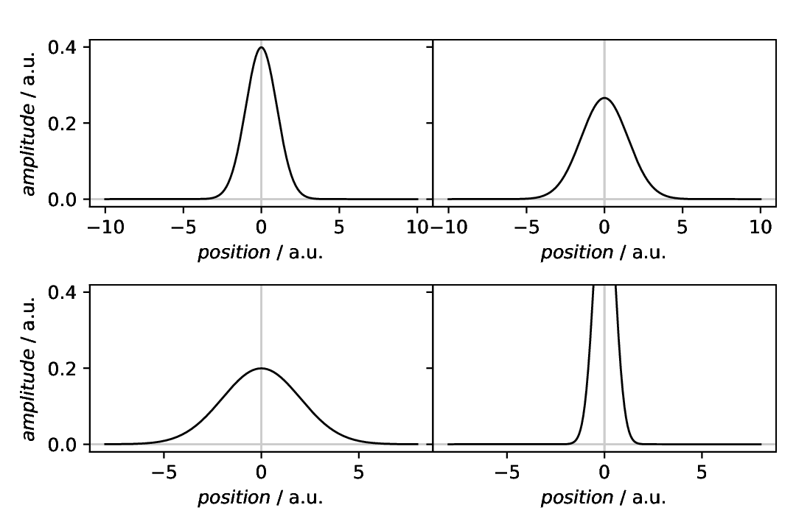
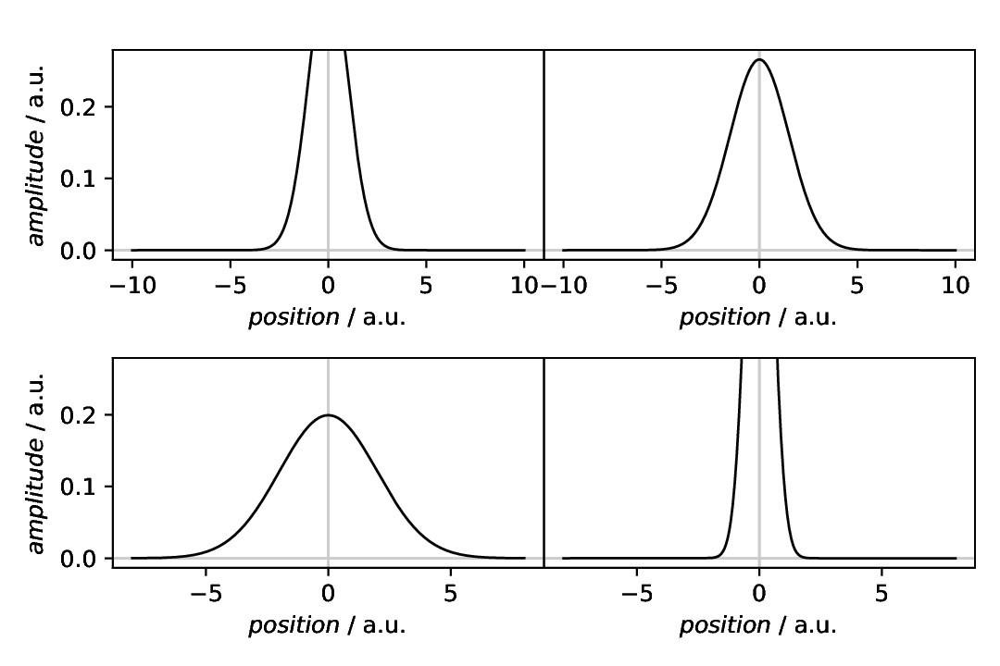
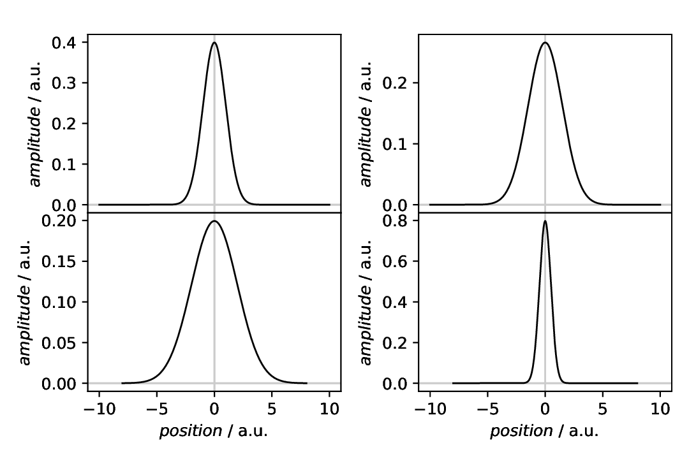
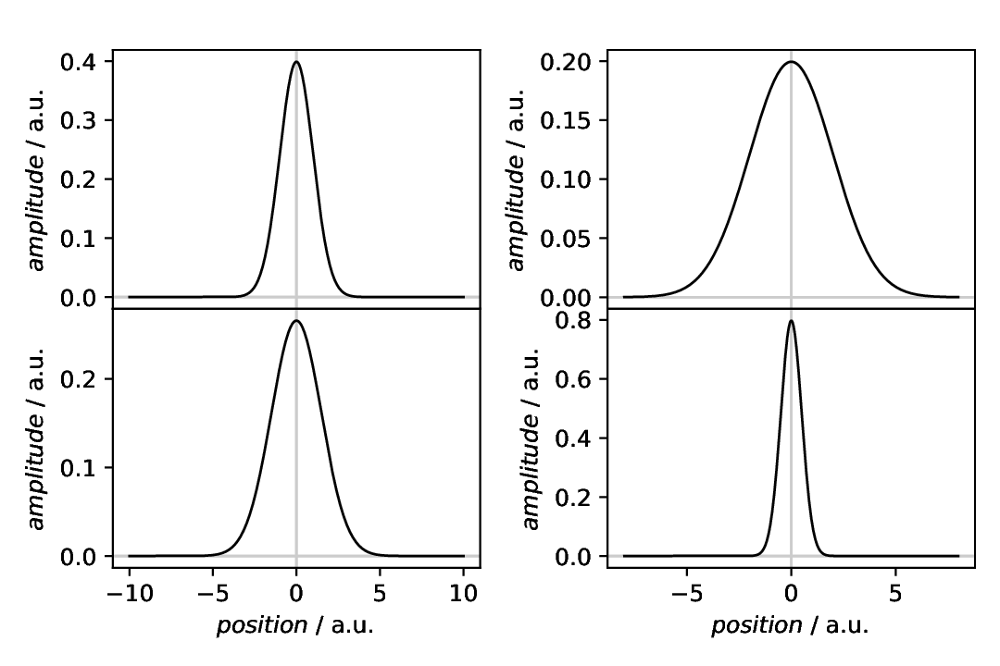
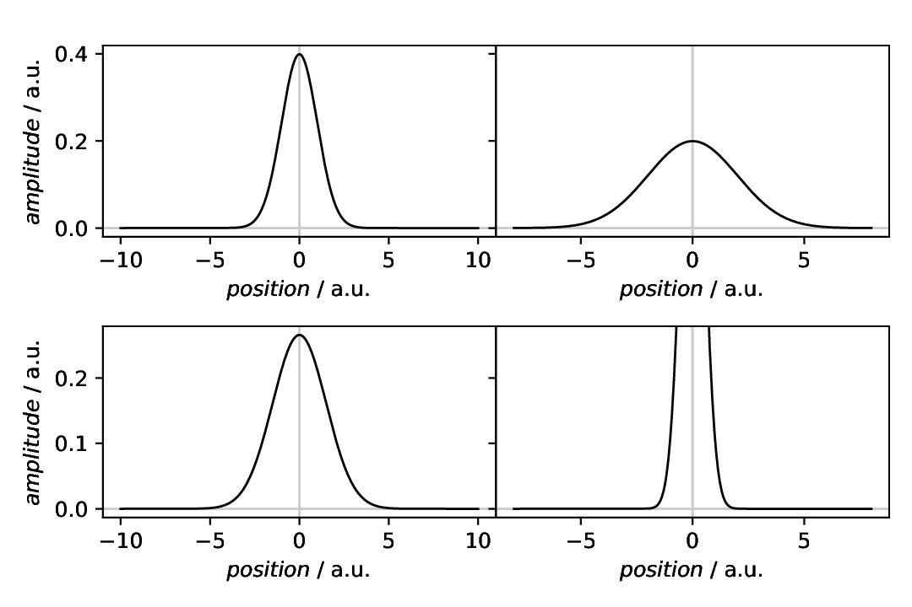
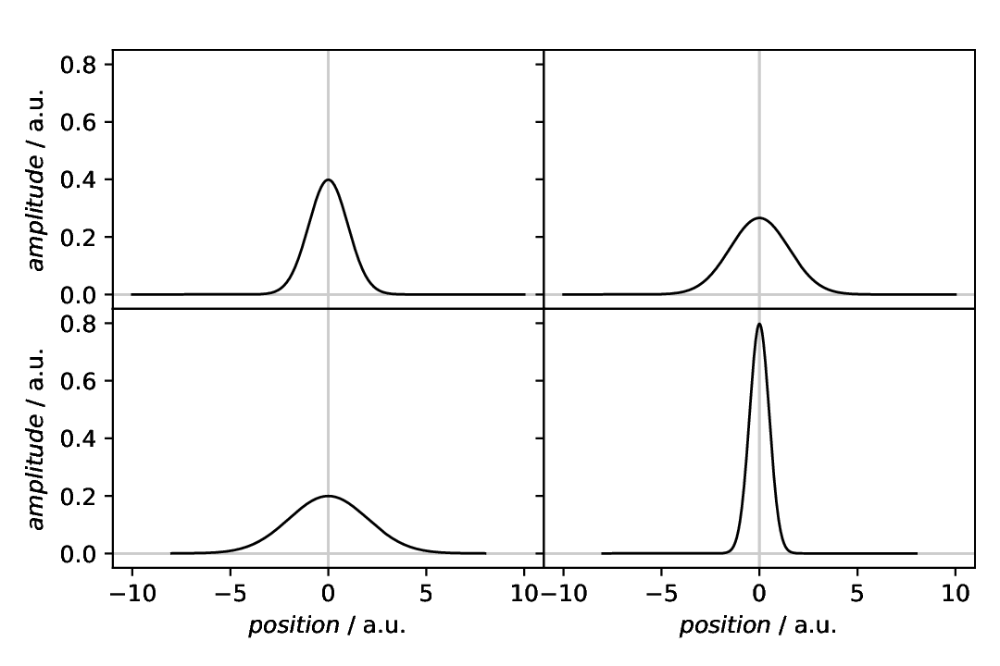

============================================
Plotting: Composite plotter with shared axes
============================================

.. sidebar:: Contents

    .. contents::
        :local:
        :depth: 2

Classes used:

* Models:

  * :class:`aspecd.model.Zeros`
  * :class:`aspecd.model.NormalisedGaussian`

* Plotting:

  * :class:`aspecd.plotting.SinglePlotter1D`
  * :class:`aspecd.plotting.CompositePlotter`

Composite plotter can be used to compare larger sets of data, and sometimes you want to share *x* or *y* axes or even both. Furthermore, you may want to share *x* axes column-wise and *y* axes row-wise. All this is possible, as shown below in a rather lengthly recipe. Just use the part you are interested in for your own purposes.

Recipe
======

Shown below is the entire recipe. As this is quite lengthly, separate parts will be detailed below in the "Results" section.

.. literalinclude:: plotting-compositeplotter-share-axes.yaml
    :language: yaml
    :linenos:
    :caption: Concrete example of a recipe demonstrating some of the many different modes of sharing axes. You can share *x* and *y* axes separately, and you can share *x* axes column-wise and *y* axes row-wise.

Comments
========

* As usual, a series of model datasets are created at the beginning, to have something to show. These are all normalised Gaussians with different line widths, resulting in different amplitudes.
* For demonstration purposes, two different *x* ranges have been used for the Gaussians.
* For simplicity, all datasets are plotted using the same plotter. Hence, to address the individual plotters in the :class:`CompositePlotter <aspecd.plotting.CompositePlotter>`, you need to provide labels using the ``result`` key.
* The sequence of defining subplot locations and plotter for the :class:`CompositePlotter <aspecd.plotting.CompositePlotter>` does matter, as the first defined axes (of a row/column) serves as reference for sharing axes with the other subplots.
* When sharing axes, only the outer labels are shown. For sharing *x* axes and plotting from top to bottom, this usually means that you do *not* see the *x* ticks for any but the lowest subplots. For sharing *y* axes and plotting left to right, as usual, you will see the *y* ticks of all axes, as they are not hidden by the other axes.
* The space between the subplots can be set using the keys ``wspace`` and ``hspace`` for the total amount of width or height for spacing between subplots. Set either to zero for axes directly next to each other.

Results
=======

Examples for the figures created in the recipe are given below. While in the recipe, the output format has been set to PDF, for rendering them here they have been converted to PNG.

.. note::

    The command line magic used to convert the PDF images to PNG images was:

    .. code-block:: bash

        for k in plotting-compositeplotter-share*pdf; do echo ${k%.*}; convert -density 180 $k ${k%.*}.png; done

As this is a rather lengthly recipe demonstrating many different scenarios, the individual cases are shown separately, each with the corresponding section of the recipe.

All *y* axes shared
-------------------

As a first example, all *y* axes are shared. With no further adjusting of the *y* axes, this may lead to unwanted effects, as shown in the corresponding figure. Furthermore, the *y* ticks of the right subplots are shown, due to the sequence of subplots from left to right. The right panels are plotted after the left ones, and hence their *y* ticks not hidden below the left panels. For shared *x* axes and plotting from top to bottom, all *x* ticks except of the lowest are usually hidden when the spacing between the subplots is set to zero.

.. literalinclude:: plotting-compositeplotter-share-axes.yaml
    :language: yaml
    :linenos:
    :lines: 83-105
    :lineno-start: 83

    Composite plotter with all *y* axes shared. Note that you can give both, ``True`` and ``all`` as options for the ``sharey`` key. Furthermore, the limits of the first defined axes (in our case top-left) are used for all other axes. Hence the vertically cut display in the bottom-right panel.

All *y* axes shared, no inner ticks
-----------------------------------

As mentioned above, with a typical plot sequence from left to right and no horizontal spacing between the panels, the ticks of the right panels are shown. To have these ticks hidden below the left panels, define the subplot locations differently, starting with the right column. Note, however, that this way another axes takes precedence as reference for the shared axes.

.. literalinclude:: plotting-compositeplotter-share-axes.yaml
    :language: yaml
    :linenos:
    :lines: 107-129
    :lineno-start: 107

    Composite plotter with all *y* axes shared and no inner ticks. The limits of the *first* defined axes are used for all other axes -- and in this case, it is the top-right subplot. Hence the vertically cut display in the top-left and bottom-right panels.

All *x* axes shared
-------------------

Analogously to sharing *y* axes, you can share all *x* axes. Typically, you want to set the vertical distance to zero, hence the height of the figure reserved for spacing between panels: ``hspace``.

.. literalinclude:: plotting-compositeplotter-share-axes.yaml
    :language: yaml
    :linenos:
    :lines: 131-153
    :lineno-start: 131

    Composite plotter with all *x* axes shared. The limits of the *first* defined axes are used for all other axes. In this case, no cutting of any axis takes place, as the first axis has the widest *x* limits.

Column-wise shared *x* axes
---------------------------

Depending on the use-case, you may want to share *x* axes not for all panels of a figure in a composite plot, but only column-wise. This can be done by setting the ``sharex`` key to one of ``["col", "columns", "column-wise"]``.

.. literalinclude:: plotting-compositeplotter-share-axes.yaml
    :language: yaml
    :linenos:
    :lines: 155-177
    :lineno-start: 155

    Composite plotter with *x* axes shared column-wise. The limits of the *first* defined axes in each column are used for the other axes of the column. In this case, the plots have been rearranged such that the panels share the same *x* axis limits column-wise.

Row-wise shared *y* axes
------------------------

Similarly to sharing *x* axes column-wise, you can share *y* axes row-wise instead of for all panels in a composite plot. This can be done by setting the ``sharey`` key to one of ``["row", "rows", "row-wise"]``.

.. literalinclude:: plotting-compositeplotter-share-axes.yaml
    :language: yaml
    :linenos:
    :lines: 179-201
    :lineno-start: 179

    Composite plotter with *y* axes shared row-wise. The limits of the *first* defined axes in each row are used for the other axes of the row. In this case, this leads to cutting of the line in the bottom-right panel.

Share *x* and *y* axes
----------------------

Finally, an example for sharing both, *x* and *y* axes. In this case, you may want to set the spacing in both directions to zero. Furthermore, to *not* cut any line in this particular case, the ``ylim`` axes properties of the :class:`CompositePlotter <aspecd.plotting.CompositePlotter>` are set, and these settings on this level always apply to *all* panels of the composite plot.

.. literalinclude:: plotting-compositeplotter-share-axes.yaml
    :language: yaml
    :linenos:
    :lines: 203-229
    :lineno-start: 203

    Composite plotter with all *x* and *y* axes shared. The limits of the *first* defined axes are used for all the other axes. In this case, a global ``ylim`` has been set in the composite plotter to prevent cuttting of of any line.

