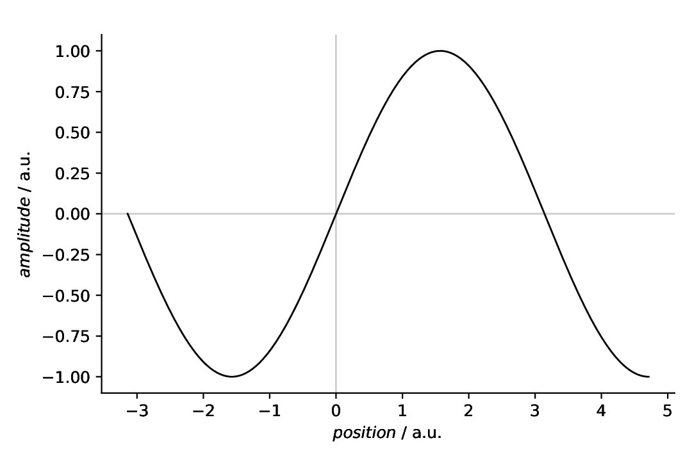
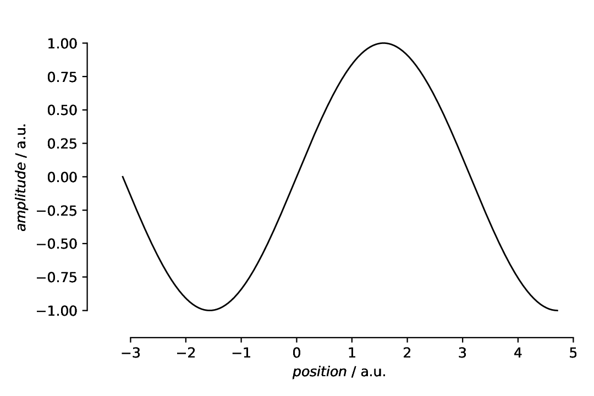
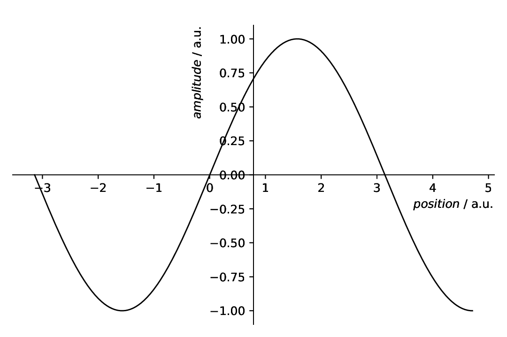
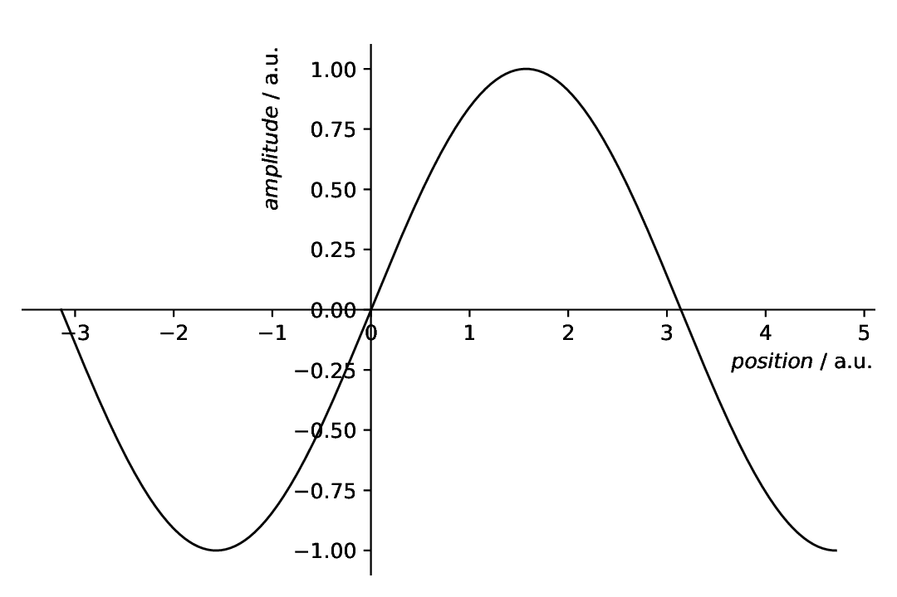
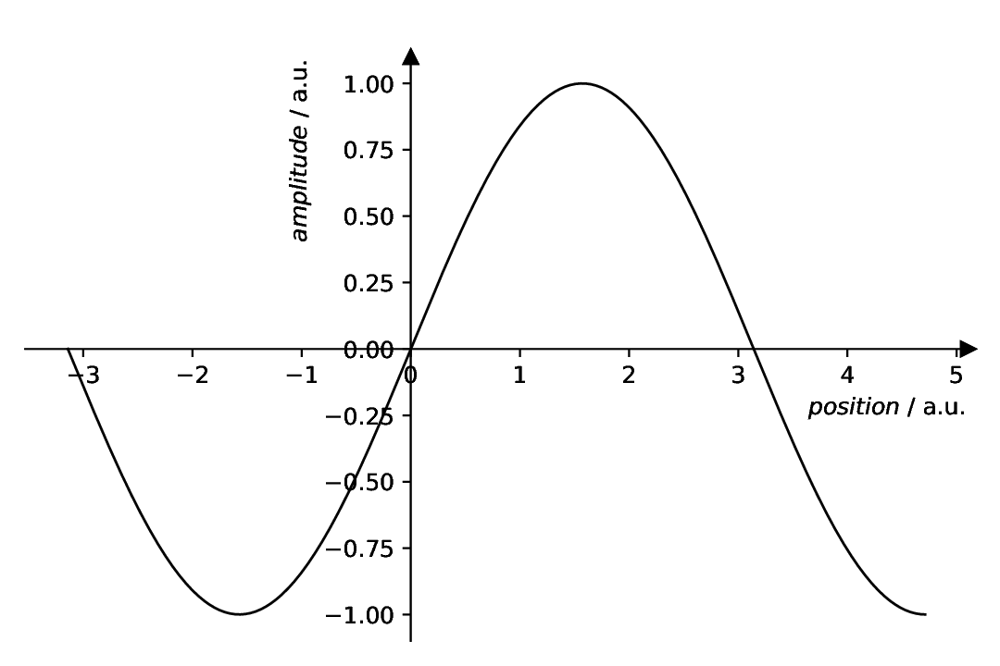
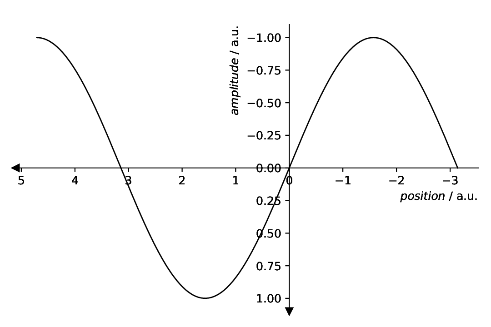

================
Plotting: Spines
================

.. sidebar:: Contents

    .. contents::
        :local:
        :depth: 2

Classes used:

* Models:

  * :class:`aspecd.model.Zeros`
  * :class:`aspecd.model.Sine`

* Analysis:

* Plotting:

  * :class:`aspecd.plotting.SinglePlotter1D`

Graphical representation of data and results is one of the most important aspects of presenting scientific results. A good figure is a figure allowing the reader to immediately catch the important aspects, not relying on reading the (nevertheless always important) caption with more description.

Probably, figures are the single most variable and configurable element of scientific data processing and analysis. While for many aspects, conventions have been established, there is much room left for individual adjustments.

Here, we focus on modifying the axes spines: the lines connecting the axis tick marks and noting the boundaries of the data area.

Recipe
======

Shown below is the entire recipe. As this is quite lengthy, separate parts will be detailed below in the "Results" section.

.. literalinclude:: plotting-spines.yaml
    :language: yaml
    :linenos:
    :caption: Concrete example of a recipe demonstrating some of the ways to control the axes spines.

Comments
========

* As usual, a model dataset is created at the beginning, to have something to show. Here, a simple sine.
* For simplicity, a generic plotter is used, to focus on the spines.

Results
=======

Examples for the figures created in the recipe are given below. While in the recipe, the output format has been set to PDF, for rendering them here they have been converted to PNG.

As this is a rather lengthy recipe demonstrating different scenarios, the individual cases are shown separately, each with the corresponding section of the recipe.

Only left and bottom spines
---------------------------

The common scenario found often in plots: You don't want to have the box, but only spines at the left and bottom part of your axes, together with ticks and labels.

.. literalinclude:: plotting-spines.yaml
    :language: yaml
    :linenos:
    :lines: 24-41
    :lineno-start: 24

As you can see, spines have their own key in the ``axes`` properties, and there are four spines: left, bottom, right, and top. Here, we simply set the visibility of the right and top spine to ``False`` and are done.

The resulting figure is shown below:

    Plot with only left and bottom spine shown.

Detached spines
---------------

Sometimes, you want to "detach" the spines from the data area. Here, it is common to set both, the ``position`` as well as the boundaries (``bounds``) of the spines. Again, we switched off the right and top spines, and positioned the left and bottom spine 10 pt outward of the data area.

.. literalinclude:: plotting-spines.yaml
    :language: yaml
    :linenos:
    :lines: 43-67
    :lineno-start: 43

The bounds are in data coordinates, with lower and upper bound, and the position is a list (originally a tuple) with position type and value. For the position, you can choose between "outward" (as used here), "axes", and "data". For details, have a look at the documentation of the :class:`SpineProperties <aspecd.plotting.SpineProperties>` class. There are two special keywords, "center" and "zero", that will be detailed below.

The resulting figure is shown below:

    Plot with only left and bottom spines, and both spines detached and restricted in their boundaries. Technically speaking, the bottom spine does not exactly match the data limits, but this is not that unusual for scientific figures.

Positioning spines: centre
--------------------------

Spines need not be positioned left, bottom, right, and top, but can be put to arbitrary positions. There are two special keywords to simplify positioning a bit: "center" will puth the spines to the centre of the coordinate system.

.. literalinclude:: plotting-spines.yaml
    :language: yaml
    :linenos:
    :lines: 69-93
    :lineno-start: 69

Whether positioning the spines in the centre is sensible is a decision of your own. This is just to show how the special keyword "center" for the ``position`` key works.

The resulting figure is shown below:

    Plot with only left and bottom spine, and both spines positioned in the centre of the coordinate system, using the special ``position`` keyword "center".

What we have done additionally here is to reposition the axes labels, as having the labels in the centre together with the splines is clearly a bad idea. There are three possibilities to position the axes labels: left, centre, right. For vertical axes, left equals bottom and right equals top.

Positioning spines: origin
--------------------------

Spines need not be positioned left, bottom, right, and top, as mentioned above. They can conveniently be put to the origin of the coordinate system using the special keyword "zero" -- and this may make much more sense than positioning them in the centre.

.. literalinclude:: plotting-spines.yaml
    :language: yaml
    :linenos:
    :lines: 95-119
    :lineno-start: 95

The resulting figure is shown below:

    Plot with only left and bottom spine, and both spines positioned in the origin of the coordinate system, using the special ``position`` keyword "zero".

Again, the axes labels have been repositioned, such as not to clash with the spines. Whether this is necessary in this case depends on the extent of your *x* and *y* axes. There are three possibilities to position the axes labels: left, centre, right. For vertical axes, left equals bottom and right equals top.

Spines with arrows
------------------

Particularly in case of only showing two spines and having them either centred or positioned in the origin, there may be interest to add arrows to the spines, to create what the Matplotlib documentation calls a "math textbook style plot". This is possible by setting ``arrow`` to ``True`` for an individual spine.

.. literalinclude:: plotting-spines.yaml
    :language: yaml
    :linenos:
    :lines: 121-146
    :lineno-start: 121

The resulting figure is shown below:

    Plot with only left and bottom spine, both spines positioned in the origin of the coordinate system, using the special ``position`` keyword "zero", and arrows added to the ends of the spines, creating what the Matplotlib documentation calls a "math textbook style plot".

Note that this is not a default property of the underlying :class:`matplotlib.spines.Spine`, but adds the arrow heads as additional plots. This functionality is inspired by an example in the Matplotlib documentation: `<https://matplotlib.org/stable/gallery/spines/centered_spines_with_arrows.html>`_.

Spines with arrows and inverted axes
------------------------------------

Having spines with arrow heads is nice, but does it work with inverted axes (as common in FTIR or NMR spectroscopy, to mention just two examples) as well? Yes, of course. ;-)

.. literalinclude:: plotting-spines.yaml
    :language: yaml
    :linenos:
    :lines: 148-176
    :lineno-start: 148

The resulting figure is shown below:

    Plot with only left and bottom spine, both spines positioned in the origin of the coordinate system, using the special ``position`` keyword "zero", both axes inverted using the ``invert`` key in the axes properties, and arrows added to the ends of the spines, creating what the Matplotlib documentation calls a "math textbook style plot".

In this case, the axes labels have been put at the "rear" side of the spines. While typically, you would put the labels close to the arrow heads, in this particular case, that does not make too much sense, at least not for the vertical axis.
