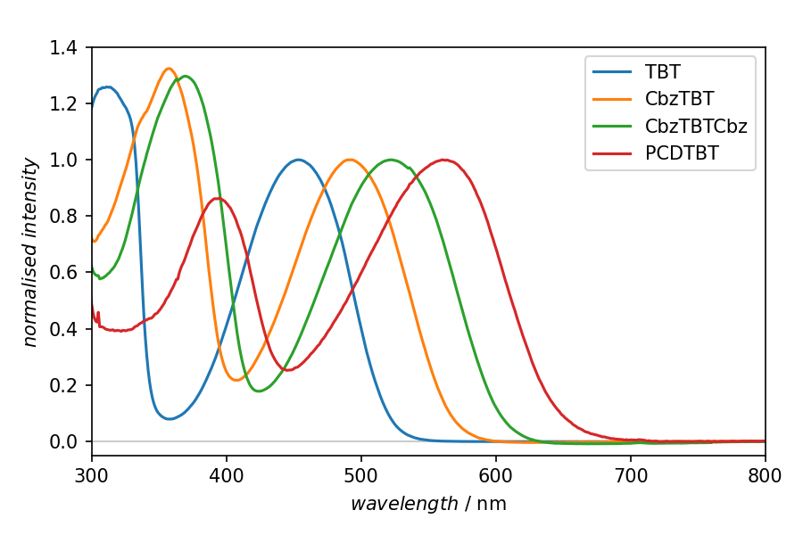

============================================
UV/Vis spectra normalised to absorption band
============================================

Measuring optical absorption (UV/Vis) spectra of samples often results in a series of measurements, and one of the first tasks is to get an overview what has been measured and how the results look like. Furthermore, if we have recorded a series of spectra for different samples, we are often interested in a comparison.

In this particular example, a series of optical absorption spectra for building blocks with varying lengths has been recorded, and we are interested in the shift of the absorption band as a function of the molecules' length.

To this end, a series of tasks needs to be performed on each dataset:

#. Import the data (assuming ASCII export)

#. Normalise to the absorption band, but explicitly *not* to the entire recorded range, as we will often have more intense side bands we are not interested in for now

#. Plot all spectra in one axis for graphical display of recorded data

.. note::

    As mentioned previously, using plain ASpecD usually does not help you with a rich data model of your dataset, containing all the relevant metadata. However, in the case shown here, it nicely shows the power of ASpecD on itself. For real and routine analysis of UV/Vis data, you may want to use the `UVVisPy package <https://docs.uvvispy.de/>`_ based on the ASpecD framework and available via PyPI.

.. literalinclude:: uvvis-normalised.yaml
    :language: yaml
    :linenos:
    :caption: Concrete example of a recipe used to plot a series of optical absorption data each normalised to their low-energy absorption band. Key here is to specify the region to normalise in *axis units*, making it rather convenient for the user. Besides that, the standard text file importer is used (with a few extra parameters such as to omit the header lines). Hence, *no metadata* are imported and the axis labels need to be set manually.

Result
======

    Result of the plotting step in the recipe shown above. The four spectra presented have been normalised to their low-energy absorption band. A detailed analysis of the data shown here is given in Matt *et al.* *Macromolecules* **51**:4341–4349, 2018. doi:`10.1021/acs.macromol.8b00791 <https://doi.org/10.1021/acs.macromol.8b00791>`_.
